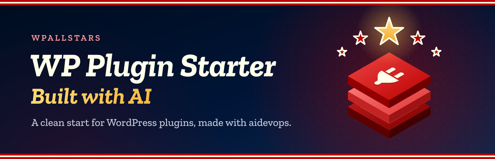

# WP Plugin Starter

<!-- aidevops:badges:start -->
<!-- On GitHub only: the Read Me tab skips this block. scripts/rename-plugin.sh rewrites it. -->

<!-- aidevops:badges:end -->

A clean start for a WordPress plugin: a settings screen, a Read Me tab, updates from GitHub and release scripts, ready for your features.

WP Plugin Starter is what wpallstars plugins are made from. It has no features of its own: it holds the parts every plugin needs, built and tested in real plugins, so a new plugin starts with them working and spends its time on what makes it different.

If this saves you time, headaches and costs, feel free to [buy me a coffee](https://buymeacoffee.com/marcusquinn), or whatever you like, to invest in making more things open-source.

Version: {WPSTARTER_VERSION}

## What you get

- **A settings screen** (Settings → WP Plugin Starter) that features fill by declaring their settings: switches, numbers, text, lists, choices and Media Library pictures, saved instantly with no Save button, searchable, in tabs. With no features yet it shows one empty tab.
- **A Read Me tab** that shows this file, banner included, so users read the same guide inside WordPress as on GitHub.
- **Features as classes**: one file per feature, off by default, with settings, hooks, one-off imports from the plugins it replaces and clean uninstall.
- **Replaced plugins**: a feature that does another plugin's job imports its settings once, waits while that plugin is active, and the Plugins screen suggests deactivating and deleting it.
- **Updates from GitHub**: the shared wpallstars updater (`includes/github-updater/`). Sites get each GitHub release as a normal WordPress update. Every wpallstars plugin carries a copy and only the newest copy on a site runs, so they are all checked together, once.
- **Two builds of each version**: the GitHub release, and a WordPress.org build without the updater, as WordPress.org requires.
- **Scripts and CI**: lint (PHP 7.4, WordPress coding and security rules, PHPStan), a smoke test on a real WordPress, the release build, a preflight check of both zips, Plugin Check, a preview site, the banner build, and `scripts/sync-core.sh` to keep each plugin's shared parts the same as the starter's.
- **Shared rules for people and AI**: `STANDARDS.md` (structure, code rules, releases, styling, testing), `DEVELOPMENT.md` (set-up and checks) and `RELEASING.md`, the same in every plugin made from the starter.

## Start a plugin

1. On GitHub, choose **Use this template** to make your repository, and clone it.
2. Give it its names: `scripts/rename-plugin.sh --slug my-plugin --name "My Plugin" --prefix MyPlugin`. Add `--css mp` for a short CSS prefix and `--repo owner/repo` if it is not under wpallstars. Put in your own details too, or the plugin keeps the starter's: `--description`, `--author`, `--author-uri`, `--contributors` (WordPress.org usernames) and `--donate` (a link, or `none`); `--help` lists them all. The new plugin starts at version 0.1.0 (`--version` for another) with a changelog of its own. Review with `git diff`, then commit.
3. Replace this README, `readme.txt`, `changelog.txt` and `AGENTS.md` with your plugin's own, and its banner (`.wordpress-org/banner.svg`, then `scripts/build-banner.sh`).
4. Add features: a class in `includes/features/` listed in `MyPlugin_Setup::FEATURES` (see Developers below and `STANDARDS.md`).
5. Keep the shared parts up to date: change them in the starter first, then run `scripts/sync-core.sh` in each plugin (`--check` lists what differs).

The easiest way to do all of this is with [aidevops](https://aidevops.sh): open the repository with it and describe the plugin you want. It reads `AGENTS.md` and `STANDARDS.md`, builds the features, tests them on a real site and runs the release checks.

## Where to find it

Go to **Settings → WP Plugin Starter**. The screen has two groups of tabs:

- **Settings**: General, empty until features add settings. Changes save instantly; there is no Save button. **Search features** (next to the plugin name) finds settings on every tab.
- **About**: this Read Me.

**Report a problem**, at the top right of the screen, opens the plugin’s [GitHub issues](https://github.com/wpallstars/wp-plugin-starter-template-for-ai-coding/issues) in a new tab. Say what you did, what you expected and what happened, with the versions of WordPress, PHP and WP Plugin Starter. Leave out passwords, licence keys and personal data, since issues are public. **Buy me a coffee**, next to it, opens the maker’s [Buy Me a Coffee](https://buymeacoffee.com/marcusquinn) page in a new tab.

## Requirements

- WordPress 6.2 or later
- PHP 7.4 or later

## Updates and releases

There are two builds of each version:

- **GitHub release** (`wp-plugin-starter-template-X.Y.Z.zip` on the repository’s Releases page): everything, including the shared updater in `includes/github-updater/`, so sites get each release as a normal update. Its main file also gets an `Update URI` header on github.com, so WordPress.org never offers a plugin of the same name in its place.
- **WordPress.org**: the same files without the updater (listed in `.distignore-wporg`) and without the `GitHub Plugin URI`, `Primary Branch`, `Release Asset` and `Update URI` header lines, because plugins hosted there may not install or update code from elsewhere.

The updater waits while Git Updater is active, so the two never both update a plugin.

Releasing on GitHub:

1. Merge the version change (`Version:` and `WPSTARTER_VERSION` in `wp-plugin-starter-template.php`, `Stable tag:` in `readme.txt`) to `main`.
2. Straight away, tag that commit `vX.Y.Z` and publish a GitHub release with `wp-plugin-starter-template-X.Y.Z.zip` attached. `scripts/build-release.sh --ref vX.Y.Z` builds it (and the WordPress.org zip) from the tag with `.distignore` applied, everything inside a `wp-plugin-starter-template/` folder; `scripts/preflight-release.sh` and `scripts/plugin-check.sh` check them first. Sites pick the latest release whose tag is a plain version number and the asset named exactly `wp-plugin-starter-template-X.Y.Z.zip`, so never attach the WordPress.org zip. Full steps: `RELEASING.md`.
3. Sites offer the update when they next check (within 12 hours, or at once with **Check again** on the Updates screen).

Mark test builds as pre-releases on GitHub (or tag them with letters, such as `v1.2.0-rc1`): sites never offer those. Do not add an `Update URI` header to the plugin file in Git: WordPress.org rejects it. The build adds it to the GitHub zip only.

## Developers

A feature is a class in `includes/features/class-wpstarter-{name}.php` that extends `WPStarter_Feature`, listed in `WPStarter_Setup::FEATURES`. It declares its settings in `settings()`, adds its hooks in `boot()` (returning early unless `self::enabled()`), and can import another plugin’s settings once in `migrate()` with `self::import_setting()`. Anything only this plugin needs goes in `WPStarter_Setup` (`includes/class-wpstarter-setup.php`): features, settings tabs, header links, settings version and its own helpers. The other files in `includes/` and `admin/` are the starter’s core files: `STANDARDS.md` → Structure.

Filters:

- `wpstarter_features`: register a feature class that extends `WPStarter_Feature`.
- `wpstarter_settings_schema`: add or change settings. Each entry sets `type` (bool, int, text, url, lines, domains, select, multi, times or media, a picture from the Media Library stored as its attachment ID), `default`, `label`, `description` and either `tab` or `parent`; select and multi also take `options` (an array or a callable), and multi takes `open` to keep saved values that are not currently registered. A child setting can take `hidden` (true): it is not shown or searched, for wiring that code sets. `reload` (true) makes the saved message ask to reload the page, for changes that show only after a page load. `replaces` (slug => name) shows which plugin a feature replaces. Settings render and save automatically.
- `wpstarter_admin_tabs`: add or reorder admin tabs. Each tab sets `label`, `group` (settings, discover or about), a `render` callback and an optional `capability`; tabs the current user lacks the capability for are hidden.
- `wpstarter_admin_script_deps` and `wpstarter_admin_script_data`: the settings screen script’s dependencies and the data it reads as `wpstarterAdmin` (both with the active tab).
- `wpstarter_can_change_settings`: return false to stop the current user changing WP Plugin Starter’s settings (on top of `manage_options`).
- `wpstarter_replaced_plugin_extras`: what a replaced plugin does on this site that WP Plugin Starter does not (plain names, plugin folder). The Plugins screen names them instead of saying the plugin can go.
- `wpstarter_stored_active_plugins` and `wpstarter_plugins_skipped`: for code that skips plugins on some requests, the active plugin files as stored and whether some are skipped on this request, so features still count those plugins as active.
- `wpallstars_github_plugins` (GitHub builds, shared updater): change which plugins update from GitHub releases (plugin file => `repo` as owner/repo, `asset_only`, `version`, `name`).
- `wpallstars_github_token` (GitHub builds, shared updater): GitHub token for a repository (token, owner/repo), for private repositories; defaults to the `WPALLSTARS_GITHUB_TOKEN` constant.
- `wpallstars_github_updater_enabled` and `wpallstars_github_updater_early` (GitHub builds, shared updater): whether it runs (false while Git Updater is active) and whether plugins also on WordPress.org take GitHub releases first.

Actions:

- `wpstarter_admin_enqueue`: enqueue the plugin’s own admin styles and scripts on its settings screen (active tab), depending on `wpstarter-admin`. Its script can use `wpstarterAdmin.api` (`post`, `speak`, `errorMessage`).
- `wpstarter_setting_saved`: a setting was saved from the admin screen.
- `wpstarter_setting_panel`: print status at the top of a setting’s options panel (setting key, schema entry); wrap it in `
`.
- `wpstarter_settings_tab_after`: print a section after a settings tab’s cards (tab slug).

Read a setting with `WPStarter_Settings::get( 'key' )`.

## Uninstall

Deleting the plugin removes its settings, its cached data, who hid lines of the Plugins screen notice about replaced plugins, and the cached GitHub releases.

## Changelog

### 1.0.6

- Developers: new core workflow `.github/workflows/starter-sync.yml`. Every Monday it compares a plugin's core files with the starter's and keeps one `starter-sync` issue open while any differ, with the files and the steps to sync; it closes the issue once they match. No setup; the repository variable `STARTER_REPO` follows another starter.
- Developers: SonarCloud runs from GitHub Actions (`.github/workflows/sonarcloud.yml`) with the new core file `sonar-project.properties`: it ignores the rules WordPress coding standards contradict, the findings that are by design (each scoped to its files with the reason) and coverage. SonarCloud reports no open issues.
- Developers: the Read Me tab's Markdown reader, the settings page navigation, the Plugins screen's replaced-plugin states and `scripts/replaced-plugins.php` are split into smaller methods, with output compared unchanged. Nothing changes for users.

### 1.0.5

- Fix: two settings saved at the same moment (two tabs, or two admins) could undo each other, as each save wrote back the whole settings array. A save now holds a short lock while it reads and writes; in a test of 20 saves at once, all 20 are kept. Uninstalling also removes the lock's row, if one was left.
- Fix: a site on the GitHub build could be offered an unrelated WordPress.org plugin with the same folder name. The GitHub zip's main file now carries an `Update URI` on github.com (added by `scripts/build-release.sh`; the WordPress.org zip has none), and the updater (1.1.0) never takes WordPress.org's answer for such a build.
- Fix: the updater no longer offers a release without its requirements when GitHub does not answer for them (it tries again within the hour), takes only `{folder}-{version}.zip` with a token, and asks for a failed private download address once, using only an https address on a GitHub download host.
- Fix: "Select all" and "Clear" on a long list of choices find the list by id, so they also work for a setting whose key holds a dot or other selector character.
- Developers: scripts report failures instead of success: `smoke-test.sh` fails a page the site did not answer, `sync-core.sh` stops when the core file list cannot be read, is empty or names an empty folder, `plugin-check.sh` fails when Plugin Check exits with an error but reports none, and `preview-site.sh` takes over a lock only when its run has gone.
- Developers: `scripts/rename-plugin.sh` takes plugin names with quotes, `$` and `&`, escaped for where they land; unsafe names and URLs are refused before any file changes.
- Developers: the settings screen's `render_field()`, the settings store's `sanitize_value()` and `search()`, and the updater's longest methods are split into small methods. HTML, values, hooks and filters are unchanged.
- Developers: the Bash scripts use `[[ ]]`, every `case` has a default, and option values are read into named variables. New core file `.codacy.yml` (Codacy skips `composer.lock`). README badges and repository metrics on GitHub, left out of the Read Me tab. Nothing changes for users.

### 1.0.4

- Developers: `scripts/rename-plugin.sh` starts the new plugin at version 0.1.0 (`--version` for another), with the changelogs in `README.md`, `readme.txt` and `changelog.txt` starting again from that version and `readme.txt`'s upgrade notices removed. Before, a new plugin kept the starter's version and changelog.
- Developers: a top-level setting with `'panel' => true` shows its Options panel even without visible child settings, so a feature can render its own controls there (`wpstarter_setting_panel`), under its switch, instead of in a separate card. Nothing changes for users.

### 1.0.3

- Developers: `scripts/rename-plugin.sh` takes `--description`, `--author`, `--author-uri`, `--plugin-uri`, `--contributors` and `--donate`, so a plugin made from the starter carries its maker's details instead of the starter's. Each is optional; left out, the starter's value stays. Nothing changes for users.

### 1.0.2

- Developers: new **Agent docs** section in `STANDARDS.md`. `AGENTS.md`, which AI agents read in every session, stays a short map: the plugin's names, its own standing rules and one line per doc saying when to read it. Guidance for one kind of task goes in `docs/{topic}.md`, which never ships (`.distignore`, `.gitattributes`). The same pattern fits a small plugin (only `AGENTS.md`) and a large one (as many docs as it needs). `scripts/preflight-release.sh` warns when `AGENTS.md` is over 150 lines, names a doc that does not exist, or leaves out one in `docs/`, and fails if `docs/` gets into a release zip. Nothing changes for users.

### 1.0.1

- Fix: a select or multi-select setting whose options list fails (its callback throws, for example when another plugin's tables are missing) no longer stops every page after an update. That list is treated as empty, so the settings upgrade finishes.
- Fix: `scripts/sync-core.sh` in a plugin made from the starter finds the starter in `wp-plugin-starter-template-for-ai-coding` next to it again, without `--from`.
- Fix: the shared GitHub updater's requests to GitHub never follow redirects, whatever other plugins set, and its private downloads survive updaters that reset `upgrader_pre_download`.
- Fix: a replaced plugin's Deactivate link works on sites with Freesoul Deactivate Plugins (`WPStarter_Replaced_Plugins::save_plugin_state()`).
- Fix: release zips leave out `DESIGN.md`.

### 1.0.0

- A fresh start, made from the parts every wpallstars plugin needs, taken from plugins in daily use: the settings screen with search, the Read Me tab, features as classes, replaced plugins, the shared GitHub updater, the release and check scripts, CI and the shared rules (`STANDARDS.md`, `DEVELOPMENT.md`, `RELEASING.md`). Earlier versions of this starter are retired; start again from this one.
- New: `scripts/rename-plugin.sh` gives a copy of the starter its own names, and `scripts/sync-core.sh` keeps a plugin's core files the same as the starter's (`--check` lists any that differ).

## Built with AI

WP Plugin Starter is built and maintained with [aidevops](https://aidevops.sh), the same developer's open-source AI harness for creating and managing anything online with AI, plugins like this one included. It is free on [GitHub](https://github.com/marcusquinn/aidevops).

## License

GPL-2.0-or-later.
