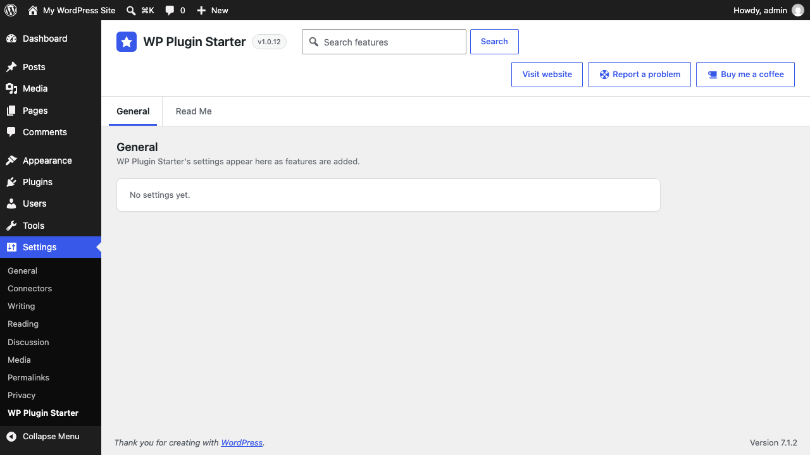
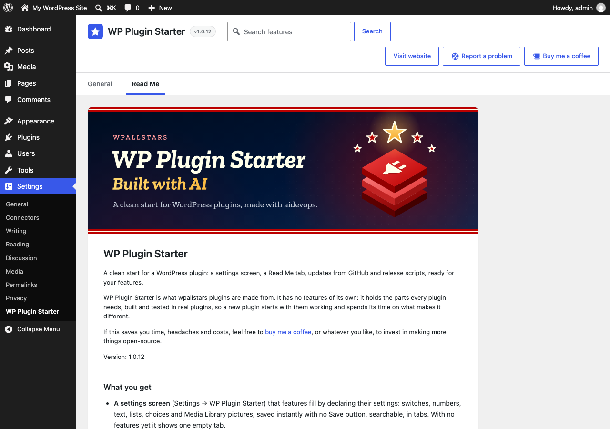

# WP Plugin Starter

<!-- aidevops:badges:start -->
<!-- On GitHub only: the Read Me tab skips this block. scripts/rename-plugin.sh rewrites it. -->

<!-- aidevops:badges:end -->

A clean start for a WordPress plugin: a settings screen, a Read Me tab, updates from GitHub and release scripts, ready for your features.

WP Plugin Starter is what wpallstars plugins are made from. It has no features of its own: it holds the parts every plugin needs, built and tested in real plugins, so a new plugin starts with them working and spends its time on what makes it different.

If this saves you time, headaches and costs, feel free to [buy me a coffee](https://buymeacoffee.com/marcusquinn), or whatever you like, to invest in making more things open-source.

Version: 1.0.27

<!-- github-only:start -->
## Screenshots

**Settings → WP Plugin Starter**: the General tab, empty until features add settings, with search and the Source code, Support and Buy me a coffee links.

**The Read Me tab** shows this file inside WordPress, banner included.

**Updates from GitHub** (GitHub build): each GitHub release is offered on the Plugins screen as a normal WordPress update.

<!-- github-only:end -->

## What you get

- **A settings screen** (Settings → WP Plugin Starter) that features fill by declaring their settings: switches, numbers, text, lists, choices and Media Library pictures, saved instantly with no Save button, searchable, in tabs. With no features yet it shows one empty tab.
- **A Read Me tab** that shows this file, banner included, so users read the same guide inside WordPress as on GitHub.
- **Features as classes**: one file per feature, off by default, with settings, hooks, one-off imports from the plugins it replaces and clean uninstall.
- **Replaced plugins**: a feature that does another plugin's job imports its settings once, waits while that plugin is active, and the Plugins screen suggests deactivating and deleting it.
- **Updates from GitHub**: the shared wpallstars updater (`includes/github-updater/`). Sites get each GitHub release as a normal WordPress update. Every wpallstars plugin carries a copy and only the newest copy on a site runs, so they are all checked together, once.
- **Two builds of each version**: the GitHub release, and a WordPress.org build without the updater, as WordPress.org requires.
- **Scripts and CI**: lint (PHP 7.4, WordPress coding and security rules, PHPStan), a smoke test on a real WordPress, the release build, a preflight check of both zips, Plugin Check, a preview site, the banner and icon build, and `scripts/sync-core.sh` to keep each plugin's shared parts the same as the starter's.
- **Shared rules for people and AI**: `STANDARDS.md` (structure, code rules, performance, releases, styling, testing), `DEVELOPMENT.md` (set-up and checks) and `RELEASING.md`, the same in every plugin made from the starter.

## Start a plugin

1. On GitHub, choose **Use this template** to make your repository, and clone it.
2. Give it its names: `scripts/rename-plugin.sh --slug my-plugin --name "My Plugin" --prefix MyPlugin`. Add `--css mp` for a short CSS prefix and `--repo owner/repo` if it is not under wpallstars. Put in your own details too, or the plugin keeps the starter's: `--description`, `--author`, `--author-uri`, `--contributors` (WordPress.org usernames) and `--donate` (a link, or `none`); `--help` lists them all. The new plugin starts at version 0.1.0 (`--version` for another) with a changelog of its own. Review with `git diff`, then commit.
3. Replace this README, `readme.txt`, `changelog.txt`, `AGENTS.md` and `LAUNCH.md` with your plugin's own, its banner and icon (`.wordpress-org/banner.svg` and `icon.svg`, then `scripts/build-banner.sh`), and screenshots (`.wordpress-org/screenshot-N.png` with captions in `readme.txt`, and GitHub-only ones in `docs/images/`). The renamer starts `LAUNCH.md` with a private pre-launch state; keep it current as releases, services and submissions change. Keep the licence and the starter's credit, as its licence requires (`ATTRIBUTION.txt`, `STANDARDS.md` → Structure): GPL-3.0-or-later, `LICENSE`, `ATTRIBUTION.txt`, the licence lines at the top of each file, both copyright lines in the main file and this README's License section, and the "Made from" line here and in `readme.txt`. Please keep the rest of the Built with AI section too.
4. Add features: a class in `includes/features/` listed in `MyPlugin_Setup::FEATURES` (see Developers below and `STANDARDS.md`).
5. Keep the shared parts up to date: change them in the starter first, then run `scripts/sync-core.sh` in each plugin (`--check` lists what differs).

The easiest way to do all of this is with [aidevops](https://aidevops.sh): open the repository with it and describe the plugin you want. It reads `AGENTS.md` and `STANDARDS.md`, builds the features, tests them on a real site and runs the release checks.

## Where to find it

Go to **Settings → WP Plugin Starter**. The screen has two groups of tabs:

- **Settings**: General, empty until features add settings. Changes save instantly; there is no Save button. **Search features** (next to the plugin name) finds settings on every tab.
- **About**: this Read Me.

At the top right of the screen, **Source code** opens the plugin’s [GitHub repository](https://github.com/wpallstars/wp-plugin-starter-template-for-ai-coding) in a new tab, and **Support** opens its [GitHub issues](https://github.com/wpallstars/wp-plugin-starter-template-for-ai-coding/issues) in a new tab. Say what you did, what you expected and what happened, with the versions of WordPress, PHP and WP Plugin Starter. Leave out passwords, licence keys and personal data, since issues are public. For questions, ask [aidevops](https://aidevops.sh) (Built with AI below). **Buy me a coffee**, next to it, opens the maker’s [Buy Me a Coffee](https://buymeacoffee.com/marcusquinn) page in a new tab.

## Requirements

- WordPress 6.2 or later
- PHP 7.4 or later

## Updates and releases

There are two builds of each version:

- **GitHub release** (`wp-plugin-starter-template-X.Y.Z.zip` on the repository’s Releases page): everything, including the shared updater in `includes/github-updater/`, so sites get each release as a normal update. Its main file also gets an `Update URI` header on github.com, so WordPress.org never offers a plugin of the same name in its place.
- **WordPress.org**: the same files without the updater (listed in `.distignore-wporg`) and without the `GitHub Plugin URI`, `Primary Branch`, `Release Asset` and `Update URI` header lines, because plugins hosted there may not install or update code from elsewhere.

The updater waits while Git Updater is active, so the two never both update a plugin.

GitHub releases are the stable beta channel: each version is released there first. WordPress.org gets a version 30 days later, once it has been used on real sites, except security releases, which go to WordPress.org at once. The WordPress.org build has no affiliate links: those listed in `.wporg-links` are replaced by plain ones when it is built.

Releasing on GitHub:

1. Merge the version change (`Version:` and `WPSTARTER_VERSION` in `wp-plugin-starter-template.php`, `Stable tag:` in `readme.txt`, `Version:` near the top of this file) to `main`.
2. Straight away, tag that commit `vX.Y.Z` and push the tag. The Release workflow (`.github/workflows/release.yml`) builds `wp-plugin-starter-template-X.Y.Z.zip` from the tag with `scripts/build-release.sh` (`.distignore` applied, everything inside a `wp-plugin-starter-template/` folder), checks it with `scripts/preflight-release.sh` and publishes the GitHub release with it attached; in a public repository it also attaches signed build provenance, which `gh attestation verify` checks. Sites pick the latest release whose tag is a plain version number and the asset named exactly `wp-plugin-starter-template-X.Y.Z.zip`, so never attach the WordPress.org zip. Full steps: `RELEASING.md`.
3. Sites offer the update when they next check (within 12 hours, or at once with **Check again** on the Updates screen).

Mark test builds as pre-releases on GitHub (or tag them with letters, such as `v1.2.0-rc1`): sites never offer those. Do not add an `Update URI` header to the plugin file in Git: WordPress.org rejects it. The build adds it to the GitHub zip only.

## Developers

A feature is a class in `includes/features/class-wpstarter-{name}.php` that extends `WPStarter_Feature`, listed in `WPStarter_Setup::FEATURES`. It declares its settings in `settings()`, adds its hooks in `boot()` (returning early unless `self::enabled()`), and can import another plugin’s settings once in `migrate()` with `self::import_setting()`. Anything only this plugin needs goes in `WPStarter_Setup` (`includes/class-wpstarter-setup.php`): features, settings tabs, header links, settings version and its own helpers. The other files in `includes/` and `admin/` are the starter’s core files: `STANDARDS.md` → Structure.

Filters:

- `wpstarter_features`: register a feature class that extends `WPStarter_Feature`.
- `wpstarter_settings_schema`: add or change settings. Each entry sets `type` (bool, int, text, url, lines, domains, select, multi, times or media, a picture from the Media Library stored as its attachment ID), `default`, `label`, `description` and either `tab` or `parent`; select and multi also take `options` (an array or a callable, which runs on every settings save, so keep it small: `STANDARDS.md` → Performance) and `open` to keep saved values that are not currently registered. A child setting can take `hidden` (true): it is not shown or searched, for wiring that code sets. A child setting with `group` set to `troubleshooting` is shown last, in a closed **Troubleshooting** section of the panel, for bypasses people need only when something is wrong (`STANDARDS.md` → Code rules); the section opens by itself when one of its settings differs from its default or matches a search. `reload` (true) makes the saved message ask to reload the page, for changes that show only after a page load. `replaces` (slug => name) shows which plugin a feature replaces; keep that list in the feature's `REPLACES` class constant and pass `self::REPLACES` (`STANDARDS.md` → Structure). Settings render and save automatically.
- `wpstarter_admin_tabs`: add or reorder admin tabs. Each tab sets `label`, `group` (settings, discover or about), a `render` callback and an optional `capability`; tabs the current user lacks the capability for are hidden.
- `wpstarter_admin_script_deps` and `wpstarter_admin_script_data`: the settings screen script’s dependencies and the data it reads as `wpstarterAdmin` (both with the active tab).
- `wpstarter_troubleshooting_open`: whether a setting's Troubleshooting section starts open (open, setting key), for a feature that fell back after an error.
- `wpstarter_can_change_settings`: return false to stop the current user changing WP Plugin Starter’s settings (on top of `manage_options`).
- `wpstarter_replaced_plugin_extras`: what a replaced plugin does on this site that WP Plugin Starter does not (plain names, plugin folder). The Plugins screen names them instead of saying the plugin can go.
- `wpstarter_stored_active_plugins` and `wpstarter_plugins_skipped`: for code that skips plugins on some requests, the active plugin files as stored and whether some are skipped on this request, so features still count those plugins as active.
- `wpallstars_github_plugins` (GitHub builds, shared updater): change which plugins update from GitHub releases (plugin file => `repo` as owner/repo, `asset_only`, `version`, `name`).
- `wpallstars_github_token` (GitHub builds, shared updater): GitHub token for a repository (token, owner/repo), for private repositories; defaults to the `WPALLSTARS_GITHUB_TOKEN` constant.
- `wpallstars_github_updater_enabled` and `wpallstars_github_updater_early` (GitHub builds, shared updater): whether it runs (false while Git Updater is active) and whether plugins also on WordPress.org take GitHub releases first.

Actions:

- `wpstarter_admin_enqueue`: enqueue the plugin’s own admin styles and scripts on its settings screen (active tab), depending on `wpstarter-admin`. Its script can use `wpstarterAdmin.api` (`post`, `speak`, `errorMessage`).
- `wpstarter_setting_saved`: a setting was saved from the admin screen.
- `wpstarter_setting_panel`: print status at the top of a setting’s options panel (setting key, schema entry); wrap it in `
`.
- `wpstarter_settings_tab_after`: print a section after a settings tab’s cards (tab slug).

Read a setting with `WPStarter_Settings::get( 'key' )`.

## Uninstall

Deleting the plugin removes its settings, its cached data, who hid lines of the Plugins screen notice about replaced plugins, and the cached GitHub releases.

## Changelog

### Unreleased

- Developers: `scripts/rename-plugin.sh` now resets `LAUNCH.md` to the new plugin's private pre-launch state, with no release or WordPress.org submission yet.
- Developers: Git ignores the files AI tools make in each checkout (`.clinerules`, `.cursorrules`, `.windsurfrules`, `MODELS.md`), so they no longer reach release zips, where Plugin Check fails hidden files. `scripts/plugin-check.sh` also expects `missing_direct_file_access_protection` in GitHub-only files (`.distignore-wporg`) in the GitHub zip: such a file may be an endpoint requested directly; WordPress.org never gets it.

### 1.0.27

- New: **View details** for plugins updated from GitHub shows what WordPress.org would. The shared updater (version 1.3.0) reads the installed `readme.txt`: the Description, Installation, FAQ, Screenshots and Changelog tabs (Other Notes for other sections), Compatible up to and the donate link, with the author linked to `Author URI`. The Changelog tab starts with a newer release's notes from GitHub, when there are any, then the readme's changelog. "Tested up to: 7.1" counts for every 7.1.x, as on WordPress.org, so the Updates screen shows the author's compatibility instead of "Not tested". Nothing more is fetched from GitHub.
- Developers: `scripts/build-banner.sh` also writes `admin/images/screenshot-N.webp` (about 25 to 75 KB each) from `.wordpress-org/screenshot-N.png` for View details; `scripts/build-release.sh` leaves them out of the WordPress.org build, and `scripts/preflight-release.sh` warns when one is missing and errors if the WordPress.org zip has one. `STANDARDS.md` → Structure and Updates from GitHub say so.
- Developers: `scripts/smoke-test.sh` lists the plugin's own database tables (`{$wpdb->prefix}{prefix}_*`) before uninstalling and fails if any is left afterwards, as it already did for options and cron events.
- Developers: support for plugins with a JavaScript build. Sources in `packages/` and `package.json`, `package-lock.json` and build tool configuration stay out of release zips (`.distignore`, `.gitattributes`; the preflight fails if one gets in); built files in `assets/build/` are committed and ship. `scripts/lint.sh build` runs the plugin's npm `check` script, then a fresh build, and fails if `assets/build/` differs; CI runs it when `package-lock.json` exists; packages' install scripts never run. `package-lock.json` is no longer ignored by Git. `DEVELOPMENT.md` → JavaScript builds has the rules. Nothing changes for plugins without a build.

### 1.0.26

- Fixed: a plugin deleted while still listed as active no longer makes a feature that replaces it wait. The base feature checks that each site or network-wide plugin has a valid path and its file still exists; installed plugins skipped on a request still count as active.
- Developers: `WPStarter_Feature::plugin_installed($file)` checks whether a listed plugin file exists at a valid path, as WordPress does when loading active plugins.

### 1.0.25

- New: GitHub updates show the plugin's icon on the Updates screen, and its banner in **View details**, instead of WordPress's grey plug. The shared updater (version 1.2.0) looks in each installed plugin's folder for WordPress.org's listing image names (`icon.svg`, `icon-256x256.png`, `icon-128x128.png`, `banner-772x250.png`, `banner-1544x500.png`, or `banner.svg`) in `admin/images/`, `assets/` or `.wordpress-org/`, and uses the installed files, so nothing is fetched from GitHub when the screen loads and private repositories work too. The icon shows from the update after the one that brings this version, as the installed copy of the updater builds the entry.
- Developers: `scripts/build-banner.sh` also writes `admin/images/icon.svg` (shipped, about 9 KB) from `.wordpress-org/icon.svg`, and `scripts/preflight-release.sh` warns when a plugin with `.wordpress-org/icon.svg` does not ship it. `STANDARDS.md` → Structure and Updates from GitHub say so.

### 1.0.24

- Developers: a child setting with `'group' => 'troubleshooting'` is shown last in its parent's Options panel, in a closed **Troubleshooting** section, so bypass lists and switches are there as a last resort without asking people to choose. The section opens by itself when one of its settings differs from its default, when a search matched one of its labels, or when the new `wpstarter_troubleshooting_open` filter (open, setting key) returns true, for a feature that fell back after an error. Values and saving are unchanged. `STANDARDS.md` → Code rules puts bypasses there. Nothing changes for users until a plugin uses it.

### 1.0.23

- Developers: `STANDARDS.md` → Structure now says where a replacing feature keeps its list: in a class constant on the feature class, `const REPLACES = array(slug => name);`, passed as `'replaces' => self::REPLACES`, so migrations, audits and checks for active plugins read the same list instead of repeating it (SonarCloud flags the repeats as duplication). `scripts/replaced-plugins.php` already reads it. The Developers section points to the rule. Nothing changes for users.

### 1.0.22

- Developers: `STANDARDS.md` → Performance has a new rule, Small choice lists. A select or multi setting's `options` callable runs on every settings save, because a save checks every setting, so it must never list what grows with the site (pages, posts, users). Mark the field `open` to keep any ID, and offer the list only where it is shown, paged or searched. From SEO Pro Stack, where one such list ran out of memory on every save on a site with 60,000 pages. The Developers section now says select takes `open` too, as it always has. Nothing changes for users.

### 1.0.21

- Fixed: two saves that find the same stale save lock no longer both take it over, and a save whose lock was taken over no longer removes the new one. Saving keeps the settings of features switched off on this request. Text, URL, lines, domains and times settings turn an array into an empty value instead of the text "Array" and a PHP notice, and a URL with a backslash is refused (browsers read `/\` as another site).
- Fixed: GitHub updates find the release zip whatever the case of owner/repo in the `GitHub Plugin URI` header, and a renamed or moved repository is reported with its new name instead of reading as "no releases". With a token, every repository it is given for is read through the API (documented). Updater 1.1.1.
- Developers: `.wporg-links` replaces whole links only, so a listed link no longer changes a longer one that starts with it, and also in SVG, XML and translation files; `build-release.sh` removes the updater headers only from the plugin header. `preflight-release.sh` finds referral links written with `&amp;` or `&#038;`, scans Markdown, CSS and SVG, warns when `README.md` has no Version line, and checks the updater files line by line. The smoke, update and Plugin Check scripts fail when they cannot check instead of passing, remove every container they started, and match the update offer exactly. `rename-plugin.sh` and `sync-core.sh` stop on a failed write and remove half-written files; `rename-plugin.sh` checks each value whole (a new line no longer passes) and sets the version `define` in either quote style; `sync-core.sh` refuses core paths outside the plugin or through symbolic links and lists a core file whose executable bit differs.

### 1.0.20

- Developers: `STANDARDS.md` → Performance no longer forbids indexes on WordPress's own tables. It forbids an index that duplicates one the table already has, which other plugins or the host may have added: check the keys (`SHOW INDEX`) first. An index on a table the plugin does not own is opt-in, and uninstall removes only the ones it added. Nothing changes for users.

### 1.0.19

- Developers: `STANDARDS.md` is under 500 lines again (481), so plugins can sync it without failing the aidevops push gate for long Markdown files. How the preview site works, its conflicts and throwaway sites moved to `DEVELOPMENT.md` → Preview site; the rules stay in `STANDARDS.md` → Testing, and the starter sync bullet points to `DEVELOPMENT.md` → Starter sync. No rule changed. Nothing changes for users.

### 1.0.18

- Changed: WordPress.org gets each version 30 days after its GitHub release, not 90 (`STANDARDS.md` → Releases, `RELEASING.md` → WordPress.org), so its users do not wait too long for fixes. Security releases still go to WordPress.org at once. [Updates and releases](#updates-and-releases) and the `readme.txt` FAQ say so.

### 1.0.17

- Developers: four rules in `STANDARDS.md` that plugins made from the starter learned. A changed default is only sure to reach new installs, as migrations and saves store every setting (Structure). SQL goes through `$wpdb->prepare()`, with the plugin's own table and column names as `%i`, which Plugin Check otherwise warns about. A notice shown once after an action adds its query argument to `removable_query_args`, so a reload does not show it again. An inline `NOSONAR` needs its reason on that line, as `phpcs:ignore` does (Code rules). Nothing changes for users.

### 1.0.16

- Changed: two release channels, at the owner's decision (`STANDARDS.md` → Releases, `RELEASING.md` → WordPress.org). GitHub releases are the stable beta channel: each version comes out there first. WordPress.org gets a version 90 days after its GitHub release, built from its tag, except security releases (changelog entries starting "Security:"), which go to WordPress.org at once. [Updates and releases](#updates-and-releases) and the `readme.txt` FAQ say so.
- Developers: the WordPress.org build has no affiliate links. A plugin lists each referral link, or its referral query, in the new optional `.wporg-links` file with its plain replacement (a tab between them); `scripts/build-release.sh` replaces them, HTML-escaped forms included, in the WordPress.org build only. `scripts/preflight-release.sh` errors when a listed text is left in that build and warns about other addresses with referral parameters (`ref=`, `aff=`, `irpid=`, `via=` and the like). `.wporg-links` stays out of both zips.

### 1.0.15

- Changed: the licence is now GPL-3.0-or-later (it was GPL-2.0-or-later), with additional terms under section 7(b) of the GPL version 3, set out in the new `ATTRIBUTION.txt`: keep the copyright notices, the "Made from WP Plugin Starter" line in `README.md` and `readme.txt`, and `ATTRIBUTION.txt` itself. Every source file starts with SPDX licence and copyright lines and a pointer to `ATTRIBUTION.txt`. Nothing changes on sites.
- Developers: plugins made from the starter take the new licence with `scripts/sync-core.sh` (`LICENSE` and `ATTRIBUTION.txt` are core files now; `ATTRIBUTION.txt` keeps the starter's names, word for word). `scripts/preflight-release.sh` expects GPL-3.0-or-later, errors when `ATTRIBUTION.txt` is missing from a zip, and warns when it is missing from Git or a source file has no SPDX copyright line.
- Developers: a licence rule for plugins made from the starter (`STANDARDS.md` → Structure): keep the licence, `LICENSE`, the GPL notice, the starter's copyright line and its credit. The starter now has a copyright line (Marcus Quinn); `scripts/rename-plugin.sh` gives a new plugin its own copyright line above it. `scripts/preflight-release.sh` checks `LICENSE` is in both zips, that `readme.txt` names the same licence as the plugin header, and warns when a copyright line is missing. Nothing changes for users.
- Developers: `scripts/preflight-release.sh` no longer stops without a message (exit 141) when `README.md` is over 64 KB: the `Version:` check read only up to the first match, so `git show` was cut off.

### 1.0.14

- New: WordPress.org icons (`icon-128x128.png`, `icon-256x256.png` and `icon.svg` in `.wordpress-org/`), the banner's plugin stack and stars on their own. `scripts/build-banner.sh` builds the PNGs from `.wordpress-org/icon.svg` when a plugin has one.
- Developers: `scripts/preflight-release.sh` checks the listing images in `.wordpress-org/`: banner and icon sizes (warnings when missing), and screenshots numbered from 1 with one `readme.txt` caption each (errors).
- Developers: `scripts/rename-plugin.sh` no longer adds a CodeFactor badge to a new plugin's README. CodeFactor serves a badge only once the repository is added on codefactor.io, so it showed as a broken image on GitHub. `DEVELOPMENT.md` → Services setup has a new step 3 for CodeFactor, with the badge to add afterwards. Nothing changes for users.

### 1.0.13

- New: screenshots at the top of this README on GitHub and in `readme.txt` → Screenshots, saved as `.wordpress-org/screenshot-N.png` (WordPress.org's `assets/` names; not in the release zip). The Updates from GitHub one is GitHub-only, in `docs/images/`, since the WordPress.org build has no GitHub updater.
- Changed: the settings screen's header buttons are **Source code** (the GitHub repository) and **Support** (GitHub issues), with **Buy me a coffee**, on one row. Developers: `{Prefix}_Setup::header_links()` takes a `source` link; an older `website` link still shows as Visit website when there is no `source`.
- Developers: the Read Me tab leaves out anything between `<!-- github-only:start -->` and `<!-- github-only:end -->`, like the badges block, for parts of `README.md` that only make sense on GitHub.
- Developers: `README.md`'s `Version:` line holds the version itself, so GitHub shows it; `scripts/preflight-release.sh` checks it and `scripts/rename-plugin.sh` sets it.

### 1.0.12

- Fixed: Updates from GitHub reads the last `Location` header when GitHub sends more than one, instead of the text "Array" and a PHP warning, when it looks up the latest release and a private release's download.
- Fixed: the settings screen's styles and script are versioned by their file times as text, falling back to the plugin version when a file time can't be read; empty script handles from the `wpstarter_admin_script_deps` filter are dropped.
- Fixed: the Read Me tab, release notes, line lists and domain lists no longer fail on text that a regular expression can't split; they are treated as empty.
- Developers: PHPStan runs at level 7 (`phpstan.neon.dist`), without the `missingType.*` checks. Plugins made from the starter fix their own level-7 findings, or note stub mistakes in `phpstan-plugin.neon`, before syncing `phpstan.neon.dist`.

### 1.0.11

- Developers: new core workflow `.github/workflows/release.yml`. Pushing a `vX.Y.Z` tag on `main` builds the zip from the tag, runs the preflight and publishes the GitHub release, with notes from this changelog. In a public repository it signs the zip's build provenance with Sigstore and attaches it as `provenance-{slug}-X.Y.Z.sigstore.json` (OpenSSF Scorecard: Signed-Releases); check a download with `gh attestation verify`. `RELEASING.md` step 3 is now tag and push; publishing by hand stays as the fallback.
- Developers: `scripts/update-test.sh` accepts the provenance bundle next to the zip and verifies it against the zip, the Release workflow and the tag; any other asset still fails. Nothing changes for users.

### 1.0.10

- Changed: the Built with AI section says the plugin works well with [SEO Pro Stack](https://github.com/wpallstars/seoprostack), the wpallstars base plugin for speed and an organised admin. `readme.txt` and the plugin's screens don't mention it.
- Developers: every plugin keeps that line in `README.md` only (`STANDARDS.md` → Structure); `scripts/preflight-release.sh` warns when it is missing. `DEVELOPMENT.md` → Test site resources: test sites run SEO Pro Stack.
- Developers: new core workflow `.github/workflows/scorecard.yml`: OpenSSF Scorecard on pushes to `main`, weekly, on branch protection changes and by hand, with results in code scanning and the Scorecard badge. No setup; skipped in private repositories (`DEVELOPMENT.md` → Checks → Scorecard).
- Developers: new core file `CODE_OF_CONDUCT.md` (Contributor Covenant 2.0), linked from `CONTRIBUTING.md`, with reports going privately to the contact in `SECURITY.md`. It stays out of both release zips. Nothing changes for users.

### 1.0.9

- Developers: `STANDARDS.md` → Performance: load only what is used, no full table scans (no unlimited queries, no lookups or sorting by `meta_value`, `LIKE '%term%'`, `REGEXP` or `ORDER BY RAND()` on large tables, indexes on the plugin's own tables), one autoloaded settings array, caching, bulk work in batches through cron, no request on every page view. Code rules add "WordPress first".
- Developers: PHPCS adds WordPress VIP's performance sniffs (`automattic/vipwpcs`, the `WordPressVIPMinimum.Performance` group only). Plugins made from the starter run `composer update` after syncing.
- Developers: `scripts/smoke-test.sh` seeds 10,000 posts (`--posts N`), lists each request's queries, and fails on a full table or index scan, or a sort without an index, over 1,000 rows in the plugin's own queries (`EXPLAIN`, with a canary that proves the check works). New core file: `scripts/smoke-queries.php`.
- Developers: `scripts/update-test.sh` accepts the release asset's API address the shared updater offers with `WPALLSTARS_GITHUB_TOKEN` set.

### 1.0.8

- Changed: the Built with AI section sends questions to [aidevops](https://aidevops.sh), which reads the plugin's docs and code to answer and can report a problem for you, and credits the starter with a "Made from WP Plugin Starter" line. `readme.txt` gets a "Where do I get help?" answer.
- Developers: every plugin made from the starter keeps both credits (`STANDARDS.md` → Structure). `scripts/rename-plugin.sh` writes the "Made from" line for a new plugin, and `scripts/preflight-release.sh` warns when a credit is missing. `DEVELOPMENT.md` → Set up recommends aidevops for development, the sites the plugins run on and questions.
- Developers: new core script `scripts/update-test.sh` for `RELEASING.md` step 4: it installs the previous GitHub release on a disposable WordPress in Docker and checks that the new release is offered from its one asset (WP-CLI, **Check again**, the Plugins screen), installs and keeps the plugin working. `--from`/`--to` pick the releases; a private repository works with `gh` and `WPALLSTARS_GITHUB_TOKEN` from the environment.
- Developers: the scripts pass text to `grep -q` and early-exit `awk` as here-strings, not pipes, so `pipefail` no longer fails a check on text over 64 KB (the preflight sometimes missed a large `changelog.txt` entry). Nothing changes for sites.

### 1.0.7

- Developers: `DEVELOPMENT.md` → Services setup gives the steps, with a check for each, to connect a new plugin's repository to SonarCloud (import, Automatic Analysis off, `SONAR_TOKEN`) and Codacy, to add `SYNC_PAT` once `main` is protected, and to run Starter sync once, with which steps wait for public launch in a private repository. The steps that need the owner's accounts or make secrets are left to the owner.
- Developers: `STANDARDS.md` → Agent docs tells AI agents to keep a plugin at the starter's standard: check for an open `starter-sync` issue first, read the starter's copy of any core file or rule the task touches, and make a change every plugin needs in the starter first. `scripts/preflight-release.sh` warns when `AGENTS.md` does not name `STANDARDS.md`. Nothing changes for users.

### 1.0.6

- Developers: new core workflow `.github/workflows/starter-sync.yml`. Every Monday it compares a plugin's core files with the starter's and keeps one `starter-sync` issue open while any differ, with the files and the steps to sync; it closes the issue once they match. No setup; the repository variable `STARTER_REPO` follows another starter.
- Developers: SonarCloud runs from GitHub Actions (`.github/workflows/sonarcloud.yml`) with the new core file `sonar-project.properties`: it ignores the rules WordPress coding standards contradict, the findings that are by design (each scoped to its files with the reason) and coverage. SonarCloud reports no open issues.
- Developers: the Read Me tab's Markdown reader, the settings page navigation, the Plugins screen's replaced-plugin states and `scripts/replaced-plugins.php` are split into smaller methods, with output compared unchanged. Nothing changes for users.

### 1.0.5

- Fix: two settings saved at the same moment (two tabs, or two admins) could undo each other, as each save wrote back the whole settings array. A save now holds a short lock while it reads and writes; in a test of 20 saves at once, all 20 are kept. Uninstalling also removes the lock's row, if one was left.
- Fix: a site on the GitHub build could be offered an unrelated WordPress.org plugin with the same folder name. The GitHub zip's main file now carries an `Update URI` on github.com (added by `scripts/build-release.sh`; the WordPress.org zip has none), and the updater (1.1.0) never takes WordPress.org's answer for such a build.
- Fix: the updater no longer offers a release without its requirements when GitHub does not answer for them (it tries again within the hour), takes only `{folder}-{version}.zip` with a token, and asks for a failed private download address once, using only an https address on a GitHub download host.
- Fix: "Select all" and "Clear" on a long list of choices find the list by id, so they also work for a setting whose key holds a dot or other selector character.
- Developers: scripts report failures instead of success: `smoke-test.sh` fails a page the site did not answer, `sync-core.sh` stops when the core file list cannot be read, is empty or names an empty folder, `plugin-check.sh` fails when Plugin Check exits with an error but reports none, and `preview-site.sh` takes over a lock only when its run has gone.
- Developers: `scripts/rename-plugin.sh` takes plugin names with quotes, `$` and `&`, escaped for where they land; unsafe names and URLs are refused before any file changes.
- Developers: the settings screen's `render_field()`, the settings store's `sanitize_value()` and `search()`, and the updater's longest methods are split into small methods. HTML, values, hooks and filters are unchanged.
- Developers: the Bash scripts use `[[ ]]`, every `case` has a default, and option values are read into named variables. New core file `.codacy.yml` (Codacy skips `composer.lock`). README badges and repository metrics on GitHub, left out of the Read Me tab. Nothing changes for users.

### 1.0.4

- Developers: `scripts/rename-plugin.sh` starts the new plugin at version 0.1.0 (`--version` for another), with the changelogs in `README.md`, `readme.txt` and `changelog.txt` starting again from that version and `readme.txt`'s upgrade notices removed. Before, a new plugin kept the starter's version and changelog.
- Developers: a top-level setting with `'panel' => true` shows its Options panel even without visible child settings, so a feature can render its own controls there (`wpstarter_setting_panel`), under its switch, instead of in a separate card. Nothing changes for users.

### 1.0.3

- Developers: `scripts/rename-plugin.sh` takes `--description`, `--author`, `--author-uri`, `--plugin-uri`, `--contributors` and `--donate`, so a plugin made from the starter carries its maker's details instead of the starter's. Each is optional; left out, the starter's value stays. Nothing changes for users.

### 1.0.2

- Developers: new **Agent docs** section in `STANDARDS.md`. `AGENTS.md`, which AI agents read in every session, stays a short map: the plugin's names, its own standing rules and one line per doc saying when to read it. Guidance for one kind of task goes in `docs/{topic}.md`, which never ships (`.distignore`, `.gitattributes`). The same pattern fits a small plugin (only `AGENTS.md`) and a large one (as many docs as it needs). `scripts/preflight-release.sh` warns when `AGENTS.md` is over 150 lines, names a doc that does not exist, or leaves out one in `docs/`, and fails if `docs/` gets into a release zip. Nothing changes for users.

### 1.0.1

- Fix: a select or multi-select setting whose options list fails (its callback throws, for example when another plugin's tables are missing) no longer stops every page after an update. That list is treated as empty, so the settings upgrade finishes.
- Fix: `scripts/sync-core.sh` in a plugin made from the starter finds the starter in `wp-plugin-starter-template-for-ai-coding` next to it again, without `--from`.
- Fix: the shared GitHub updater's requests to GitHub never follow redirects, whatever other plugins set, and its private downloads survive updaters that reset `upgrader_pre_download`.
- Fix: a replaced plugin's Deactivate link works on sites with Freesoul Deactivate Plugins (`WPStarter_Replaced_Plugins::save_plugin_state()`).
- Fix: release zips leave out `DESIGN.md`.

### 1.0.0

- A fresh start, made from the parts every wpallstars plugin needs, taken from plugins in daily use: the settings screen with search, the Read Me tab, features as classes, replaced plugins, the shared GitHub updater, the release and check scripts, CI and the shared rules (`STANDARDS.md`, `DEVELOPMENT.md`, `RELEASING.md`). Earlier versions of this starter are retired; start again from this one.
- New: `scripts/rename-plugin.sh` gives a copy of the starter its own names, and `scripts/sync-core.sh` keeps a plugin's core files the same as the starter's (`--check` lists any that differ).

## Built with AI

WP Plugin Starter is built and maintained with [aidevops](https://aidevops.sh), the same developer's open-source AI harness for creating and managing anything online with AI, plugins like this one included. It is free on [GitHub](https://github.com/marcusquinn/aidevops).

Questions about using, changing or building on WP Plugin Starter: ask aidevops. Open this repository, or the site it runs on, with aidevops and ask; it reads the plugin's docs and code to answer, and can report a problem for you.

Made from [WP Plugin Starter](https://github.com/wpallstars/wp-plugin-starter-template-for-ai-coding), the wpallstars starter plugin. Its shared standards and the weekly Starter sync keep this plugin up to date.

Works well with [SEO Pro Stack](https://github.com/wpallstars/seoprostack), the wpallstars base plugin for every site: it speeds WordPress up and keeps the admin organised, each job a switch you turn on.

## License

GPL-3.0-or-later (the full text is in `LICENSE`), with the additional terms in `ATTRIBUTION.txt` (GPL-3.0 section 7(b)): keep the copyright notices and the "Made from" credit.

Copyright (C) 2026 Marcus Quinn
